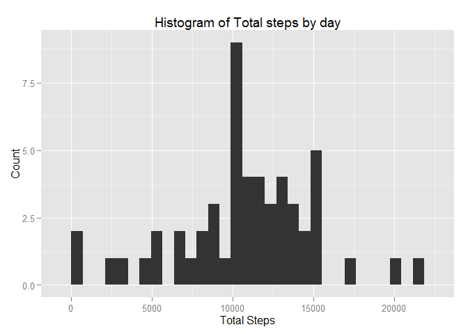
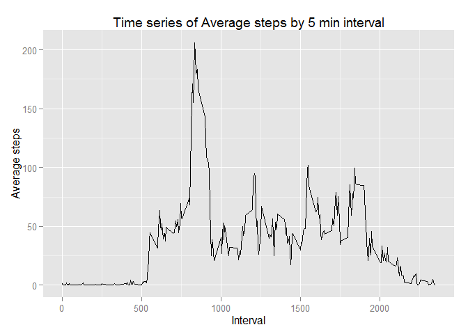

# Reproducible Research: Peer Assessment 1


## Loading and preprocessing the data
First clear out R and set the working directory

```r
rm(list=ls())
setwd("C:/_WORK/COURSERA/DataScience/ReproducibleResearch/Proj1/RepData_PeerAssessment1")
library("sqldf")
library("ggplot2")
library("dplyr")
```
Then read in the csv and change the type of the `date` column

```r
activity<-read.csv("activity.csv", header = TRUE, na.strings = "NA")

activity$date <- as.Date(activity$date , "%Y-%m-%d")
head(activity)
```

```
##   steps       date interval
## 1    NA 2012-10-01        0
## 2    NA 2012-10-01        5
## 3    NA 2012-10-01       10
## 4    NA 2012-10-01       15
## 5    NA 2012-10-01       20
## 6    NA 2012-10-01       25
```


## What is mean total number of steps taken per day?
First subset the data

```r
activityDay<-sqldf("select date, sum(steps) as TotSteps from activity where steps<>'NA' group by date")
```
This is a histogram of the total steps

```r
p<-ggplot(data=activityDay, aes(activityDay$TotSteps)) + geom_histogram()+labs(title="Histogram of Total steps by day") +
  labs(x="Total Steps", y="Count") 
print(p)
```

 

The mean number of steps, rounded to 1 decimal place, is 10766.2 and the median is 10765

## What is the average daily activity pattern?
First summarise the data by interval.

```r
activityInterval<-group_by(activity, interval)
activitybyInterval<-summarise(activityInterval,meanSteps=mean(steps, na.rm=TRUE))
```
then plot the average number of steps by 5 minute interval

```r
q<-ggplot(data=activitybyInterval, aes(x=interval,y=meanSteps)) + geom_line()+labs(title="Time series of Average steps by 5 min interval") +
  labs(x="Interval", y="Average steps") 
print(q)
```

 

On average the highest number of steps occurs when `interval=`835.


## Imputing missing values


## Are there differences in activity patterns between weekdays and weekends?
